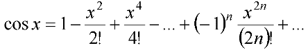
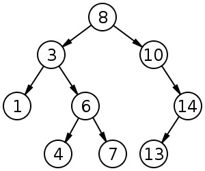
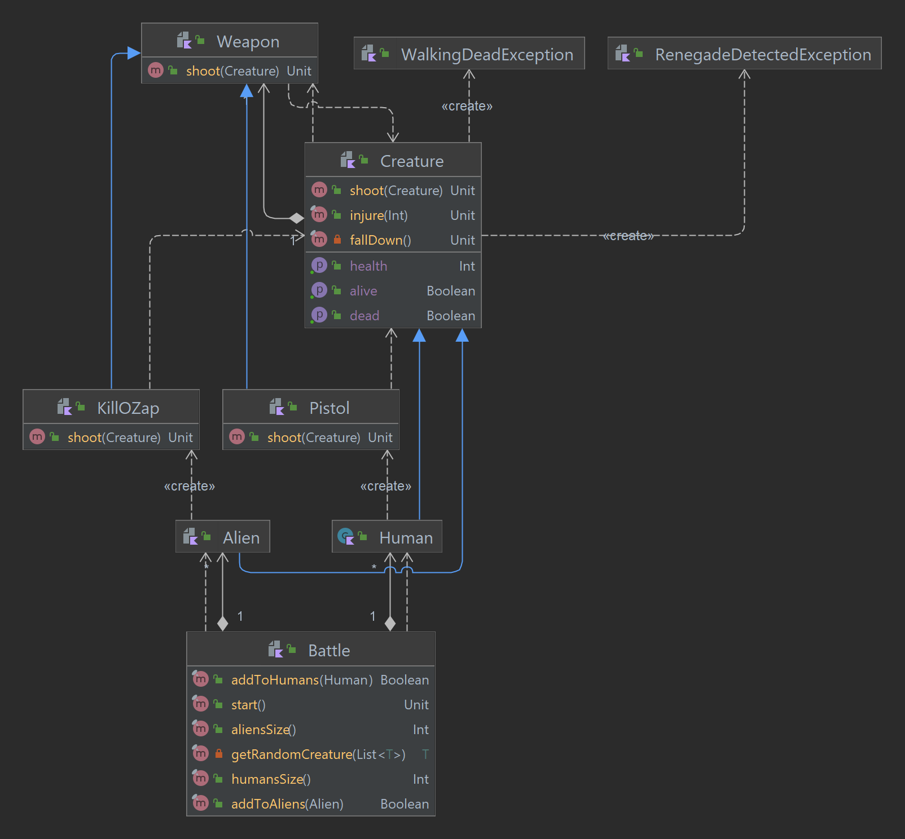

# Лабораторная работа №1
## 1) Функция `sec(x)`
> Для функции `sec(x)` провести модульное тестирование разложения функции 
> в степенной ряд. Выбрать достаточное тестовое покрытие.

Функция `sec(x)` и её график выглядят следующим образом:

.png)

.png)

Используем разложение функции `cos(x)`:

Кроме того, так как разложение функции даёт меньшую погрешность около нуля, 
используем свойства периодичности данной функции для получения более точного результата.

**Разложение функции ([Math.kt](src/main/kotlin/ru/stolexiy/Math.kt)).** 

Для тестирования используется подготовленный набор значений 
([набор значений](src/test/resources/sec-tests.csv)).
Также првоеряются основные свойства функции, 
такие как периодичность и чётность.

**Тестирование разложения 
([MathTest.kt](src/test/kotlin/ru/stolexiy/MathTest.kt)).**
## 2) Бинарное дерево поиска
> Провести тестирование модуля для работы с бинарным деревом поиска BST.

В качестве модуля для работы с BST был разработан класс 
[BinarySearchTree](src/main/kotlin/ru/stolexiy/BinarySearchTree.kt), 
в котором есть следующие операции:

* обхода дерева в отсортированном порядке
* поиск элемента
* добавление и удаление
* нахождение максимального и минимального элементов

Для тестирования были выбраны характерные точки алгоритма:

* простое добавление элемента
* поиск ранее добавленного элемента
* обход в отсортированном порядке
* поиск максимального и минимального элементов дерева
* удаление элемента как с двумя дочерними узлами и без дочерних узлов

**Тестирование BST ([BinarySearchTreeTest.kt](src/test/kotlin/ru/stolexiy/BinarySearchTreeTest.kt)).**

Тестовое дерево:

## 3) Доменная модель

> Сформировать доменную модель для заданного текста.  
> Разработать тестовое покрытие для данной доменной модели

Описание предметной области: 
> Медленно и осторожно он подошел к первому телу. 
> Оно лежало обнадеживающе тихо, и продолжало лежать так, 
> когда он приблизился к нему вплотную и поставил ногу на килобац, 
> который оно все еще сжимало скрюченными пальцами.

Полученная доменная модель

 

и реализация ([DomainModel.kt](src/main/kotlin/ru/stolexiy/DomainModel.kt)),
а также тестовое покрытие ([DomainModelTest.kt](src/test/kotlin/ru/stolexiy/DomainModelTest.kt)).

***
[Итоговое тестовое покрытие](out/test-report.zip)