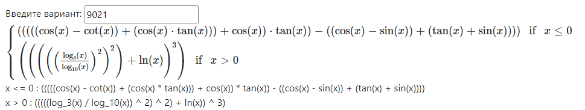
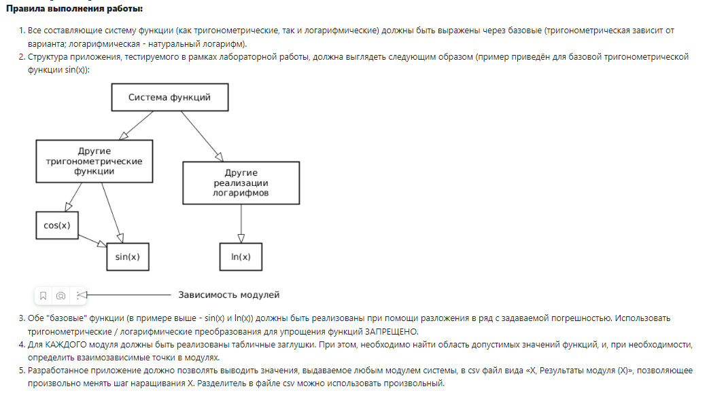
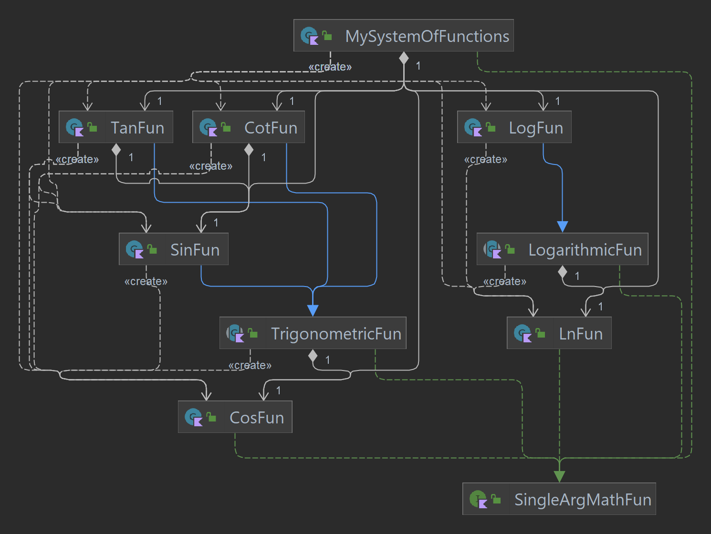
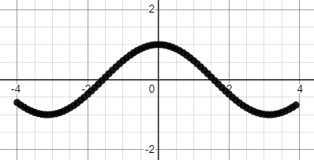
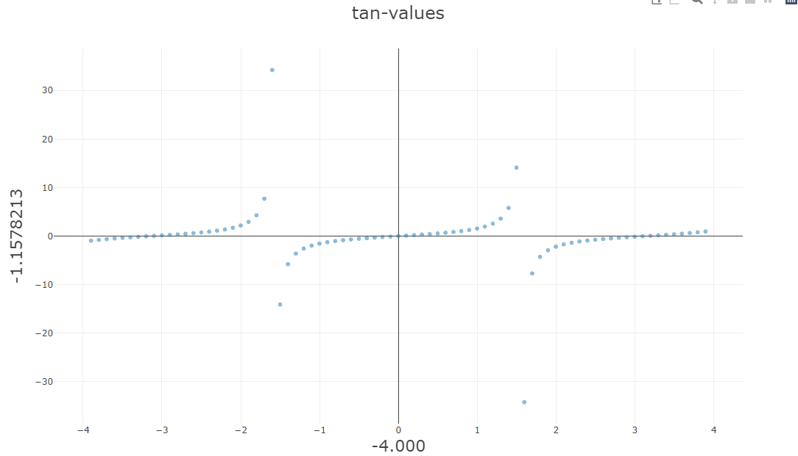
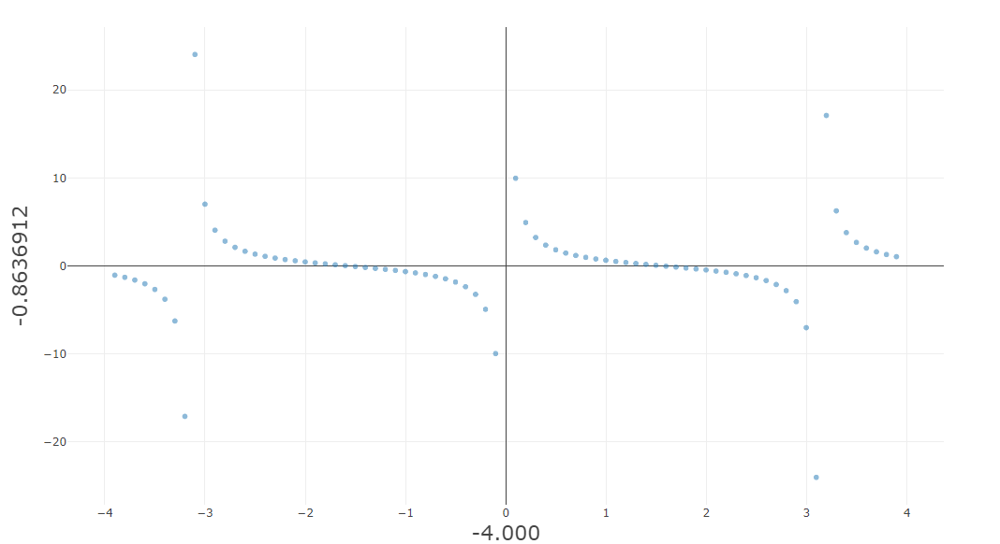
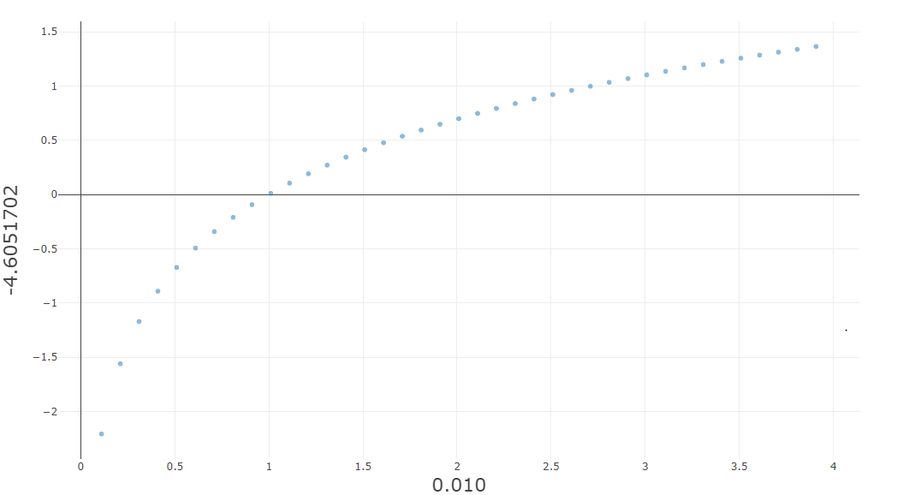
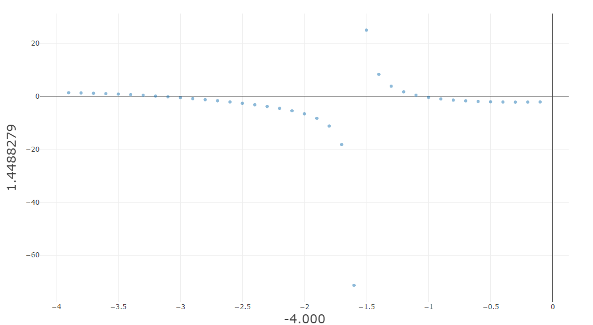
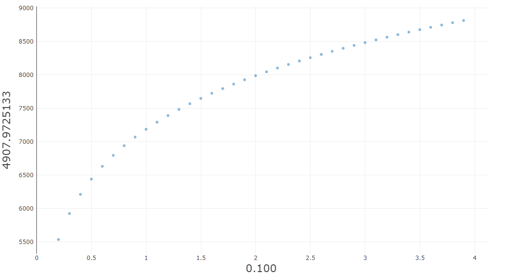

# Лабораторная работа №2 (вариант №9021)
## 1) Текст задания, система функций
> Провести интеграционное тестирование программы, осуществляющей вычисление системы функций (в соответствии с вариантом).
> Система функций:
>
> 
>
> Задание:
>
> 

## 2) UML-диаграмма классов разработанного приложения

[Реализация функций](src/main/kotlin/ru/stolexiy)

[Тестирование реализованных функций](src/test/kotlin/ru/stolexiy)

## 3) Графики, построенные csv-выгрузкам, полученным в процессе интеграции приложения

[Полученные csv-выгрузки](out)

### cos:

### tan:

### cot:

### ln:

### Система при `x <= 0`:

### Система при `x > 0`:

